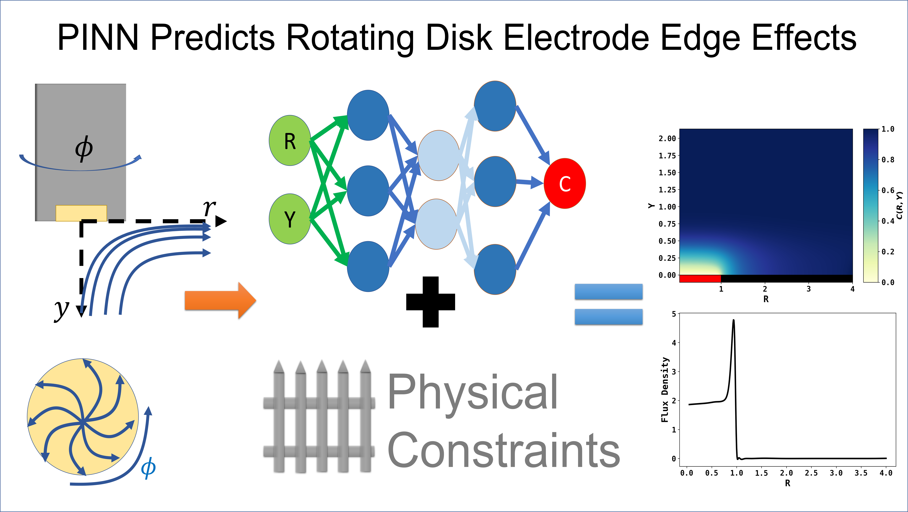

# PINN4RDE

This is the code repository for "Rotating Disk Electrodes Beyond Levich Approximation: Physics-Informed Neural Networks Reveal and Quantify Edge Effects" submitted to *Analytical Chemistry* and "Removing 65 Years of Approximation in Rotating Ring Disk Electrode Theory with Physics-Informed Neural Networks" acccepted*The Journal of Physical Chemistry Letters*. 

In simple, this repository shows Physics-Informed Neural Network (PINN) solution to the convective-diffusion problem of Rotating Ring Electrode (RDE) and Rotating Ring Disk Electrode (RRDE).

The weights of neural networks are provided to help users reproduce the results. Please note that due to the stochastic nature of neural networks, your own training results may vary slightly.

# Requirements
Python 3.7 and above is suggested to run the program.The neural networks was developed and tested with Tensorflow 2.3 (for RDE) and 2.11 (for RRDE). Common machine learning and datascience package including Numpy, Pandas, sklearn are required. Note that the results will be varied slightly depending of different hardware environment and the initial states of neural networks.

# Background

## Rotating Disk Electrode 
 Using Physics-Informed Neural Networks(PINNs) to solve convective-diffusion problem (both 1-D and 2-D) for rotating disk electrode(RDE). Using PINN, we can not only apply multiple Schmidt number correction terms to obtain a more accurate velocity profile, but also explicity solve for edge effect via 2-D simulations. 

 In this repository, we present the capability of PINN to solve convective-diffusion mass transport where numerical methods are challenged or defeated. 

 For example, the edge effect of RDE was not solved but "guessed" by Smyrl and Newman (see [their paper](https://iopscience.iop.org/article/10.1149/1.2408250) here). Using PINN, we have solved them explicity and a working curve is provided. 

 ## Rotating Ring Disk Electrode
 Accurately solving the convective-diffusion problem to accurately solve for the disk flux, ring flux and thus the collection efficiency remains  a challenge 65 years since the birth of RRDE. The most common used analytical equation develoved by Albery and Bruckenstein neglected the radial diffusion part of the convective-diffusion equation and used the approximated velocity field. Here, we developed PINN to uncompromisingly solve the RRDE problem. 

# Six Test Cases for RDE
There are 6 folders, each serving a different scenario. They are:

* FD RDE 1D Simulation: 1-D simulation of RDE using Finite Difference Method (FDM) with Levich approximation. 
* PINN CV 1D Simulation: 1-D simulation of RDE using PINN algorithm with Levich approximation and no Schmidt number correction terms. The predicted results are compared with FD simulations implmented in the folder above. 
* PINN RDE CV 1D Simulation with Sc Corrections: Using PINN, we can easily introduce up to six Schmidt number correction terms to obtain more accurate results. 
* PINN RDE CA 1D Simulation: Simulation of potential-step chronoamperometry using PINN.
* PINN RDE 2D Simulation: Using PINN to simulate 2-D steady state cocnentration profile at RDE. This Scenario is to analyze the edge effect at RDE and a working curve is provided to respond to Newman's guess. 
* PINN RDE 2D Simulation with Sc Corrections: Schmidt number corrections (in both r and y directions) can even be included for the problem above.

# One Case for RRDE
* PINN RRDE 2D Simulation: Include the python script to build and train a PINN to solve the convective diffusion problem for RRDE. The weights and data files are too large to be uploaded. Contact the author if you want these information. 

# Issue Reports
Please report any issues/bugs of the code in the discussion forum of the repository or contact the corresponding author of the paper. 

# Cite 
To cite, please refer to [Anal. Chem. 2023, 95, 34, 12826–12834](https://doi.org/10.1021/acs.analchem.3c01936) for RDE and [J. Phys. Chem. Lett. 2024, 15, 24, 6315–6324](https://pubs.acs.org/doi/full/10.1021/acs.jpclett.4c01258) for RRDE.

